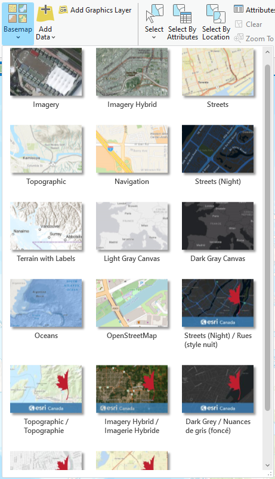
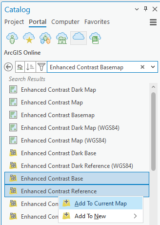
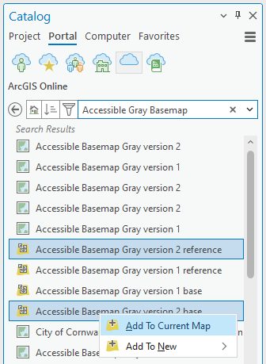
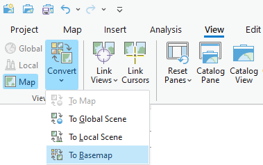

{: .no_toc}  
# Lesson 2 - Basemaps

The lessons following the introduction will walk through the process of creating and sharing maps, starting with selecting a basemap.

  

    Table of Contents
  

  {: .text-delta }
- TOC
{:toc}

## Lesson Objectives
- Switch between basemaps in ArcGIS Pro.
- Learn where to find additional basemaps, including ones built with accessibility in mind.
- Learn how to make your own basemap.

## Basemaps
One of the first ways to symbolize your map is to choose a basemap which provides a background and context for your data.

### Basemap Options
ArcGIS Pro includes a number of basemaps in the basemap gallery. These include a default topographic map, imagery, feature specific options, as well as simple grayscale maps. These can be seen by clicking the Basemap button in ArcGIS Pro, as shown below.

{: .new-title }
> Activity
> 
> In ArcGIS Pro, open the project from the previous lesson and try switching between basemaps in the Central Wellington map to see how they appear with the data.
> 
> Zoom in and out on the map to see how the basemap changes at different scales.
>
> Where multiple layers (e.g. base, reference, hillshade) make up the basemap, try toggling on and off each of the basemap layers to see the changes.

### Additional Basemaps

In addition to the basemaps in the Basemap Gallery, more basemaps can be found by searching ArcGIS Online or the Living Atlas. These include basemaps designed with enhanced colour contrast, strong colours, simplified features, and clear fonts. For more information on the creation and features of these enhanced contrast basemaps, see the following articles from Esri.

[Towards an accessible basemap](https://www.esri.com/arcgis-blog/products/arcgis-living-atlas/mapping/towards-an-accessible-basemap/)

[A Gray Accessible Basemap](https://www.esri.com/arcgis-blog/products/arcgis-living-atlas/mapping/a-gray-accessible-basemap/)

{: .new-title }
> Activity
> 
> Using the same ArcGIS Project, open or select the Wellington City map.
> 
> In the Catalog pane, under Portal, search ArcGIS Online for "enhanced contrast basemap" or "accessible gray basemap".
>
> Right-click the item in the list to add the basemap and corresponding reference layer to your map (see images below).
> 
> Zoom in and out and pan to different areas to explore the features of the enhanced basemaps.

| Enhanced Contrast Basemap | Accessible Gray Basemap |
|--------------|---------------|
|  |  |

### Make Your Own

Lastly, you can create custom basemaps by converting an existing map to a basemap or creating a basemap using datasets. For this activity, we will use the Central Wellington Map from the same project.

{: .new-title }
> Activity
> 
> Open the Central Wellington map.
> 
> In the View tab, click the Convert button and select To Basemap.
>
> Right-click the item in the list to add the basemap and corresponding reference layer to your map (see images below).
> 
> You should now see the Central Wellington Basemap (Central Wellington_BM) listed in your Basemap Gallery and within the Maps folder of your project.

### Save your Project

{: .highlight }
Don't forget to save your work!

Simply click the Save button on the Quick Access toolbar or Ctrl S.

## Summary
This lesson covered: 
- Which basemaps are available in ArcGIS Pro and how to switch between them.
- How to access basemaps from the ArcGIS Online Portal, including ones designed to better meet Web Content Accessibility Guidelines.
- How to create your own basemap from a map.

## Additional Resources
If you're feeling adventurous and want to explore further customization of basemaps, below is a tutorial series from Esri.

[Personalize your map with custom basemap styles](https://mediaspace.esri.com/channel/ArcGIS+Pro/238049152)
