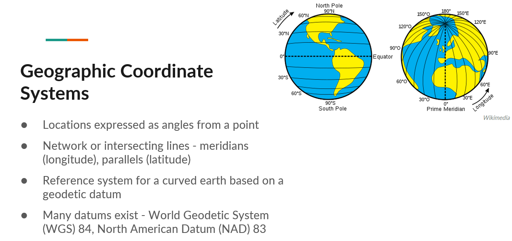
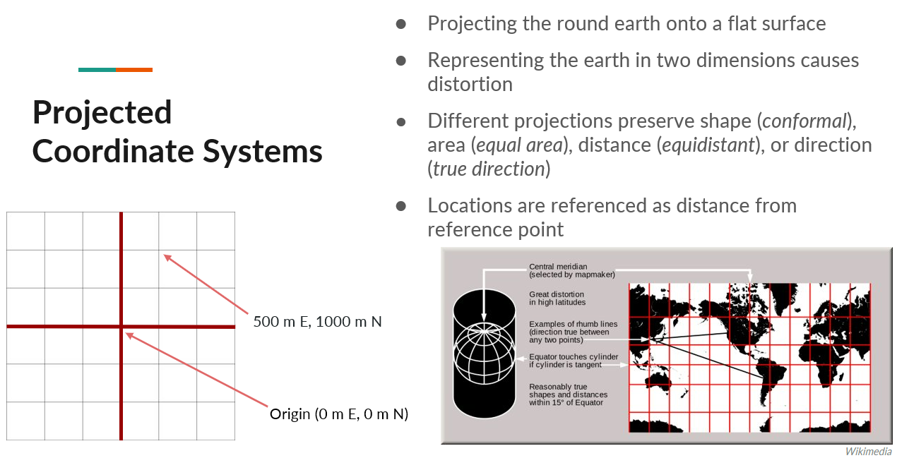
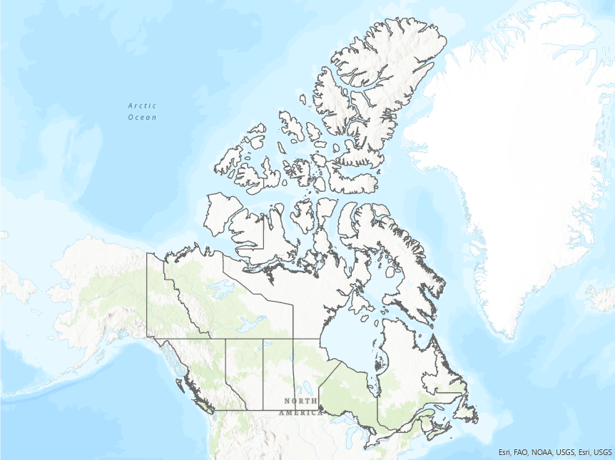
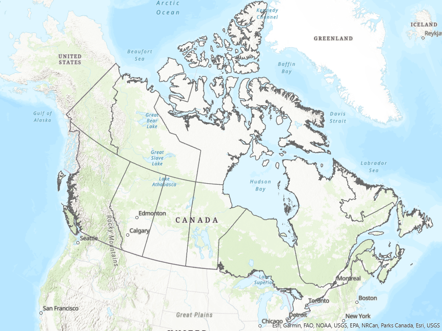
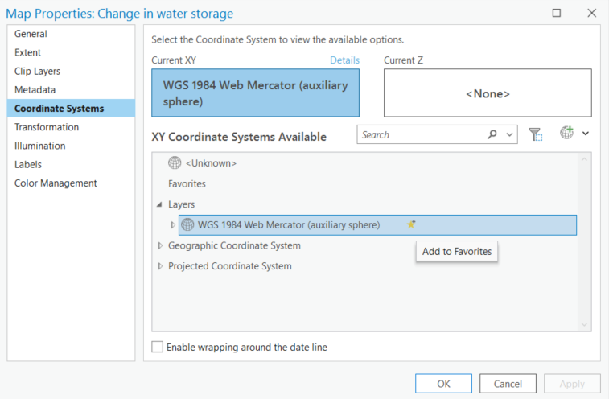
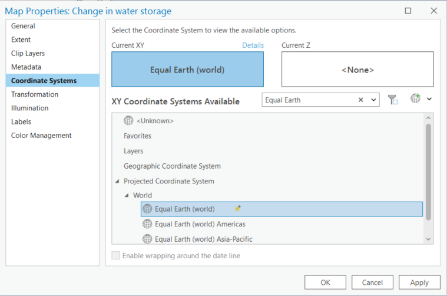
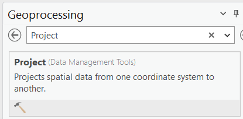
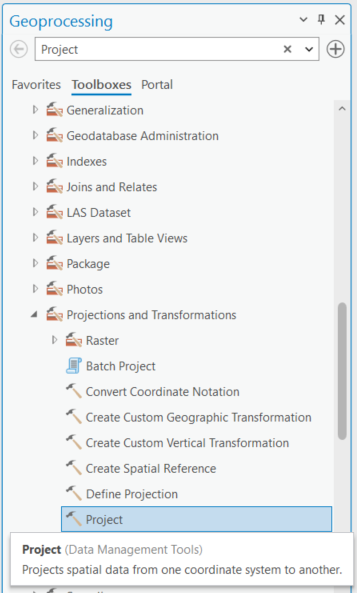
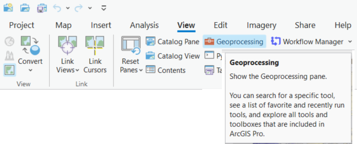
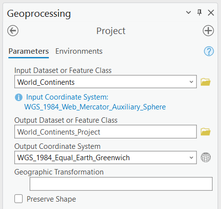

{: .no_toc}  
# Lesson 3 - Coordinate Reference Systems 

  

    Table of Contents
  

  {: .text-delta }
- TOC
{:toc}

## Lesson Objectives
- Be introduced to the concept of geographic and projected coordinate systems and why they're important.
- Learn to convert datasets between two coordinate systems.

## Coordinate Reference Systems

Coordinate reference systems are a way of referencing the location of features on the earth's surface. There are two methods – geographic coordinate systems and projected coordinate 
systems.

### Geographic Coordinate Systems

Geographic coordinate systems express locations as angles from a point. They are made up of a series of *meridians* - lines of longitudes which converge at the poles, and *parallels* - lines of latitudes that run parallel and never meet.

> 

### Projected Coordinate Systems

Projected coordinate systems are a method of representing the earth in two dimensions. Locations in this case are represented as distances from a reference point. 

By projecting a round earth onto a flat surface, you introduce distortion. The example shown on this slide is the Mercator projection. As shown by the red grid lines, the areas of least distortion are closer to the equator, increasing as you get closer to the poles. 

> 

For a comprehensive list of different projections and types, along with their properties, suitable extents, location, orientation, and purpose, see the following chart from Esri, adapted from a USGS map projections poster.

[Quick Notes on Map Projections](https://www.arcgis.com/sharing/rest/content/items/e8b85d508d2c4f21a3dec4e52dc7d9c4/data)

### Why is this important?

Choosing a coordinate system that matches your study area and intended use will limit unintended distortion and misrepresentation or misinterpretation of the map. Take for example these two maps of Canada.

{: .new-title }
> Activity                                           
> 
> The following two maps show the provincial and territorial boundaries of Canada using two different projected coordinate systems - Mercator and Lambert Conformal Conic.
>
> Examine the maps and make note of differences between the two.

| Web Mercator Projection | Lambert Conformal Conic Projection |
|--------------|---------------|
|  Scale 1:80,000,000|  Scale 1:27,500,000 |
| [View the original Mercator image](https://github.com/scds/ArcGIS-Pro/blob/main/lessons/img/Canada_Mercator_Map.png) | [View the original Lambert image](https://github.com/scds/ArcGIS-Pro/blob/main/lessons/img/Canada_LCC_Map_Zoom.png) |

## In ArcGIS Pro

The activities in the following sections will use the Map Projections Project Package from Esri, available at the following link.

[Map Projections Project Package](https://www.arcgis.com/sharing/rest/content/items/3980eb073a294a51b6a809abc661e43f/data) (direct download)

This project package is used in the [Choose the right projection](https://learn.arcgis.com/en/projects/choose-the-right-projection/) tutorial from Esri, available through the [Learn ArcGIS website](https://learn.arcgis.com/en/gallery/).

### Map Properties: Coordinate Systems

To change the coordinate system of the map, right-click the map in the Contents pane, select Properties then Coordinate System.

Within the map properties, you can see the current coordinate system and search for, or browse to, a different coordinate system.

You can also add coordinate systems to a list of favourites by clicking the star symbol.

{: .new-title }
> Activity                                           
> 
> Either by browsing or using the search bar, change the coordinate system of the *Change in water storage* map to the Equal Earth projected coordinate system as shown in the image below.
> 
> Explore the map to see the changes.

This projections is particularly useful for thematic maps at the global scale where areas are preserved.

Selecting the coordinate system in the map properties only affects how the map is displayed, it doesn't transform the coordinate system of the data.

### Project Data

It's best to ensure all datasets in your map are in the same coordinate system, appropriate for your analysis.

To change the coordinate system of vector data, use the *Project* tool found in the Data Management toolbox. This tool can be accessed in a couple ways:

1. Search for the Project tool in the Geoprocessing pane

2. Browse the toolbox for the Project tool found under Data Management

If the geoprocessing pane isn't open, click the View tab and select the Geoprocessing button.

{: .new-title }
> Activity                                           
> 
> Change the coordinate system of the *World Continents* layer to match that of the map.

|Project Tool|Parameters|
|---|---|
||Where: <ul><li>Input Dataset = the dataset being projected</li><li>Output Dataset = the resulting (projected) dataset</li><li>Output Coordinate System = the new coordinate system</li></ul>

## Summary
This lesson covered: 
- An introduction to the concept and importance of coordinate reference systems, and geographic and projected coordinate systems.
- How to choose the coordinate system for your map.
- How to convert, or project, data between coordinate systems.

## Additional Resources (optional)
Portions of this lesson were drawn from the Esri tutorial *Choose the right projection*. 

For more information on projection types and the properties of different projections that will help you decide which one is best for your application, see - [Choose the right projection](https://learn.arcgis.com/en/projects/choose-the-right-projection/). This tutorial will also show how to modify existing projected coordinate systems and create a custom one.

