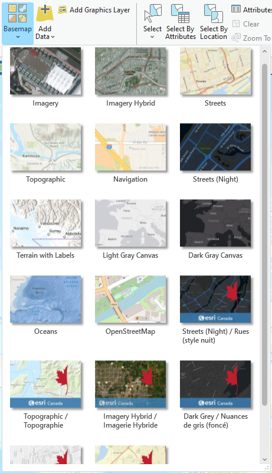

{: .no_toc}  
# Lesson 3 - Coordinate Reference Systems 

This lesson will go into further detail about the symbology options for different types of data.

  

    Table of Contents
  

  {: .text-delta }
- TOC
{:toc}

## Lesson Objectives
- Switch between basemaps in ArcGIS Pro.
- Learn about projections and coordinate systems and how they may affect maps.
- Get to know different symbology options based on different data types - numeric and thematic or categorical.

## Basemaps
The first option for map symbology are basemaps. This is one of the simplest ways of styling a map.

ArcGIS Pro includes a number of basemaps in the basemap gallery. These include a default topographic map, imagery, feature specific options, as well as simple grayscale maps. These can be seen in the embedded ArcGIS Online map, or by clicking the Basemap button in ArcGIS Pro, shown below.

<iframe width="100%" height="400" frameborder="0" scrolling="no" marginheight="0" marginwidth="0" title="Basemap Activity" src="//mcmaster.maps.arcgis.com/apps/Embed/index.html?webmap=fb43f01ab1a84c5c92ffbb100a5ffb10&extent=-80.7166,42.9407,-79.0302,43.5698&home=true&zoom=true&previewImage=false&scale=true&search=true&searchextent=true&basemap_gallery=true&disable_scroll=false&theme=light"></iframe>

{: .new-title }
> Activity 1                                           <!-- This is where you edit the title -->
> 
> Explore the available basemap options in the above map by using the basemap selector (button with four squares) to switch between basemaps.                   <!-- Question Text -->
> 
> In ArcGIS Pro, open the project from the previous lesson and try switching between basemaps to see how they appear with data overlaid.
> 
> Zoom in and out on the map to see how the basemap changes at different scales.                <!-- Optional Additional Text -->

## Projections and Coordinate Systems

Coordinate reference systems are a way of referencing the location of features on the earth's surface. There are two methods – geographic coordinate systems and projected coordinate 
systems.

### Geographic Coordinate Systems

Geographic coordinate systems express locations as angles from a point. They are made up of a series of *meridians* - lines of longitudes which converge at the poles, and *parallels* - lines of latitudes that run parallel and never meet.

### Projected Coordinate Systems

Projected coordinate systems are a method of representing the earth in two dimensions. By projecting a round earth onto a flat surface, you introduce distortion. 
Locations in this case are represented as distances from a reference point. 
The example shown on this slide is the Mercator projection. As shown by the red grid lines, the areas of least distortion are closer to the equator, increasing as you get closer to the poles. 

### Why is this important?

Depending on which geographic or projected coordinate system you use, you can visually misrepresent your data which may also cause errors in measurement or result in datasets being offset from their locations and one another.

{: .new-title }
> Activity 2                                           
> 
> The following two maps show the provincial and territorial boundaries of Canada using two different projected coordinate systems - Mercator and Lambert Conformal Conic.
>
> Examine the maps and make note of differences between the two.

| Mercator Projection | Lambert Conformal Conic Projection |
|--------------|---------------|
|  Scale 1:80,000,000|  Scale 1:27,500,000 |

## Symbology

<!-- Include a text version of your topic here. -->

### Thematic / Categorical Data
### Numeric Data

## Summary

<!-- - Remind the student about what they just learned.
- You can also note down any key information to keep in mind. -->

## Additional Resources (optional)
<!--
- Here, you can list some additional resources the student can access to learn more about this lesson. -->
