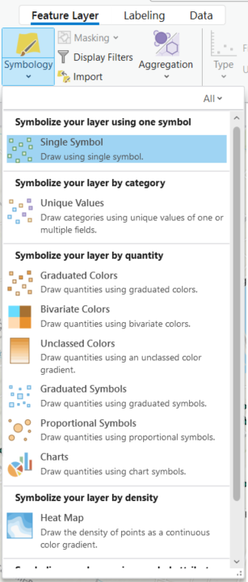
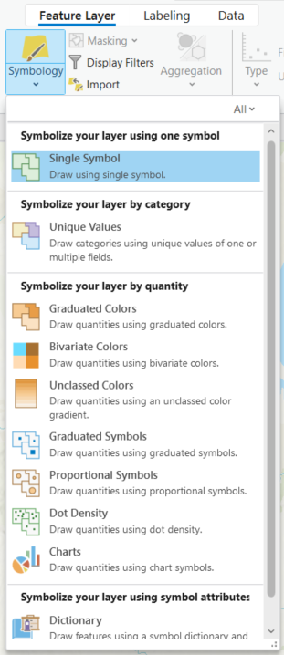

{: .no_toc}  
# Lesson 4 - Symbology

  

    Table of Contents
  

  {: .text-delta }
- TOC
{:toc}

## Lesson Objectives

- Learn to symbolize data by feature or data type.

## Symbology
There are several ways to symbolize or visualize data on a map based on feature type, quantitative, or qualitative values.

Point symbols can be visualized using different colours, sizes, or icons.

Polygons or areas can also be filled in with colours to represent numeric, thematic, or categorical data. If using this method to display values, use proportions rather than raw values.

|Point Symbology|Polygon Symbology|
|----------|----------|
|||

When selecting the symbology ensure the symbols are clear and legible to the reader. This includes considerations for colour blindness. The View tab of ArcGIS Pro includes a colour vision simulator for different vision types. The [Colour Brewer](https://colorbrewer2.org/) tool also suggests colour ranges based on the number of classes and nature of the data.

{: .new-title }
> Activity
> 
> Follow along with the video by repeating the steps in ArcGIS Pro.>
> 

<iframe width="100%" height="416" allowfullscreen frameborder=0 src="https://www.youtube.com/embed/6ZqbKvOZ1lE?si=flCBGQOkO55V_EIv" title="Symbolize map layers in ArcGIS Pro"></iframe>

[View original video here](https://youtu.be/6ZqbKvOZ1lE)

The text version of the tutorial can be found in the [Documentation](https://pro.arcgis.com/en/pro-app/latest/get-started/symbolize-your-data.htm).

## Summary
This lesson covered:
- How to symbolize point, line, and polygon features based on values or themes.

## Additional Resources (optional)
Below are links to additional resources which go into more detail on map symbology:

- [Cartographic creations in ArcGIS Pro](https://learn.arcgis.com/en/paths/cartographic-creations-in-arcgis-pro/) - Tutorial Series
- [Design symbology for a thematic map in ArcGIS Pro](https://learn.arcgis.com/en/projects/design-symbology-for-a-thematic-map/arcgis-pro/)
- [Improve 3D thematic symbology](https://learn.arcgis.com/en/projects/improve-3d-thematic-symbology/)

