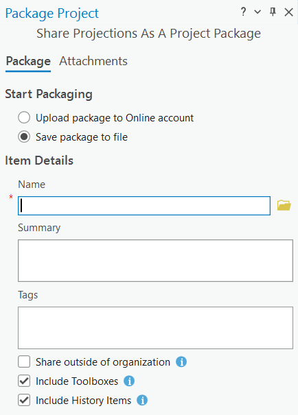

{: .no_toc}  
# Lesson 5a - Web Maps and Project Packages
Once your map has been completed, it can be shared with others in a few ways.

This lesson will walk through the process of sharing maps as web maps or project packages.

  

    Table of Contents
  

  {: .text-delta }
- TOC
{:toc}

## Lesson Objectives
- Share a web map
- Share a project package

## Share a Web Map
Maps created in ArcGIS Pro can be shared to ArcGIS Online as an interactive web map. From there, they can be shared further with groups or the public, embedded in a website, or used to create an app. The following video shows the process of sharing a web map.

{: .new-title }
> Activity
> 
> Using a map from a previous lesson, or the *Share a web map v310* from ArcGIS Online, follow the steps in the video below.

<iframe width="100%" height="416" allowfullscreen frameborder=0 src="https://www.youtube.com/embed/RUHOf6P6Bl0?si=WOf79q9PNAVHqCZo" title="Share a web map in ArcGIS Pro"></iframe>

[View the original video from Esri here](https://youtu.be/RUHOf6P6Bl0)

## Share a Project Package
Another way to share a project is to create a project package. A project package includes all components of a project and can be saved to file or shared to ArcGIS Online. This allows for collaboration or creating a copy of the project as a backup.

{: .new-title }
> Activity
> 
> Follow along with the steps from Esri's documentation page to [Share a project package](https://pro.arcgis.com/en/pro-app/3.1/help/sharing/overview/project-package.htm), or see below for a brief overview of the process.

In the Share tab, select Project. Choose to save the project either to file or upload to your ArcGIS account and fill out the required parameters.

Choose to Analyze the package to check for errors. If necessary, resolve the errors and re-run the analysis.

Click Package to package the project.

## Summary
This lesson covered:

- How to share a map to ArcGIS Online, which can be shared, embedded in a website, or used to create a web application.
- How to share a project package for others to use and modify in ArcGIS Pro. 

## Additional Resources (optional)
Below are links to additional resources that expand or build upon the information above:

- [Share a map](https://learn.arcgis.com/en/projects/share-a-map/) (Learn ArcGIS tutorial, Esri)
- [Create an app](https://learn.arcgis.com/en/projects/create-an-app/) (Learn ArcGIS tutorial, Esri)
- [Convert a static map into a web map](https://learn.arcgis.com/en/projects/convert-a-static-map-into-a-web-app/) (Heather Smith, Esri)
